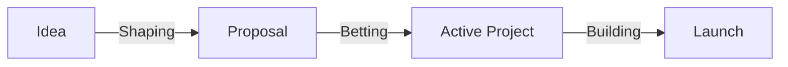

# Tembo Handbook

## Team meetings

* Two all-hands meetings per week, Monday and Thursday/Friday
* Monday —> planning, focused on “what will execute this week”
* Thursday/Friday —> demo and share back what was accomplished

## How our work flows from idea to launch

### Idea

* Create a Linear issue for the idea, tagged `#idea`.
* Solicit feedback from the team by posting in `#ideas` Slack channel. Do not share with small private group of people. We want to allow everyone to participate in defining/debating/refining ideas.
* All commentary/disussion should take place in Linear, not Slack.
* Continue shaping the idea until it's ready to be selected to build.

### Proposal

* Once the idea is ready for potential selection, create a project in Linear, inside an active Initiative in the `Proposed` state, and create a Linear doc linked to the project.

### Active Project

* Track in Linear, break down as needed

### Launch

* During the 2-week gap between cycles, we launch.